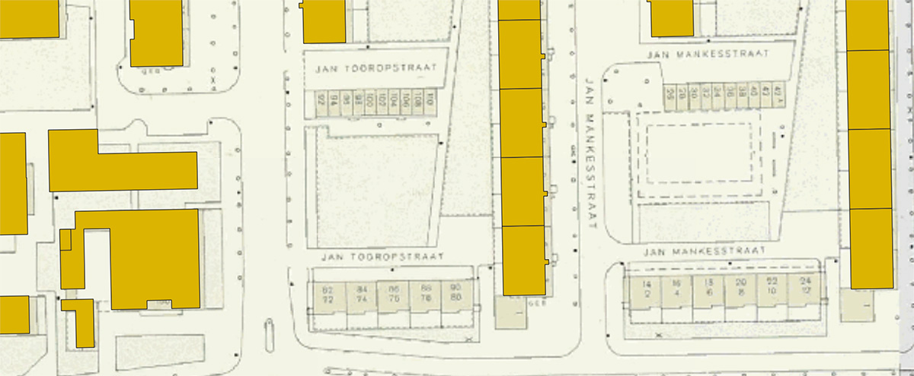
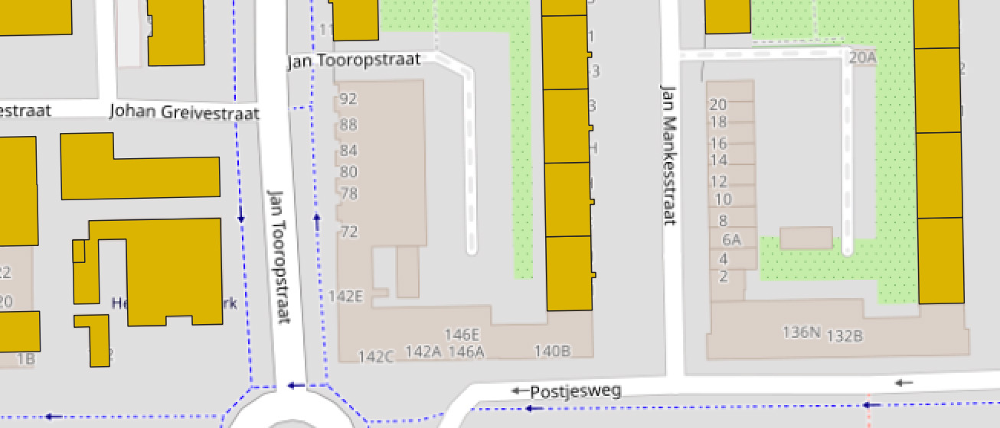
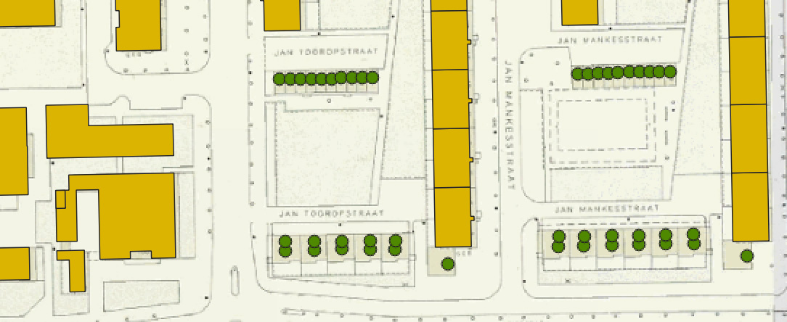
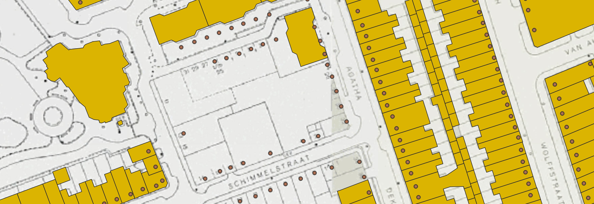
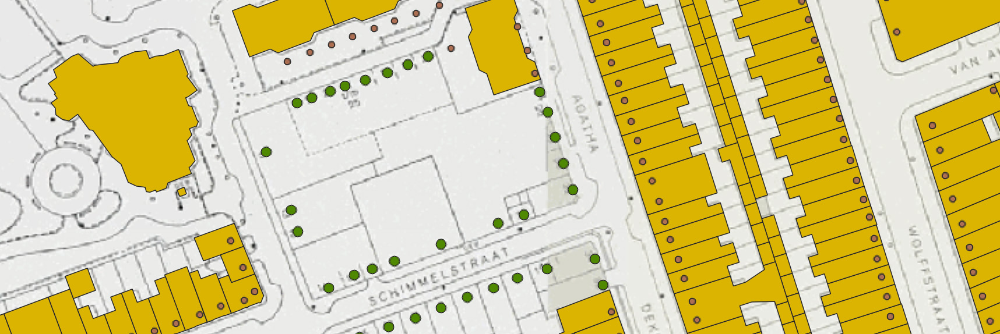
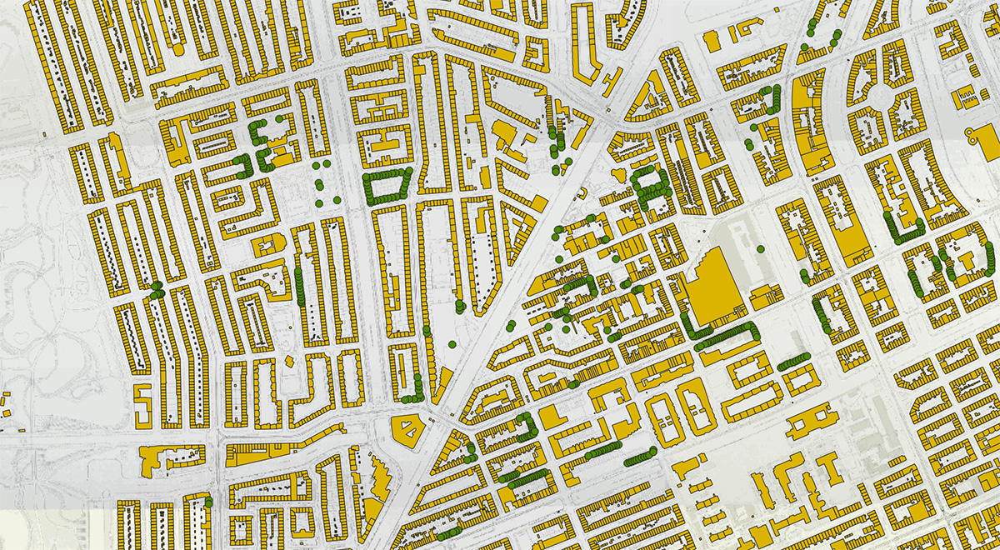
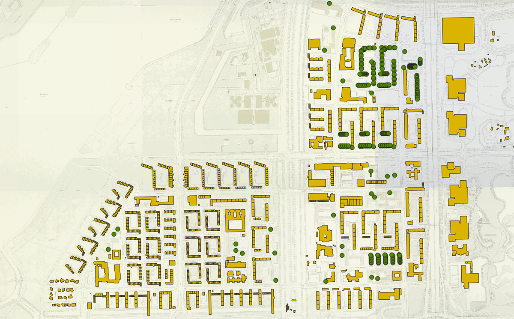
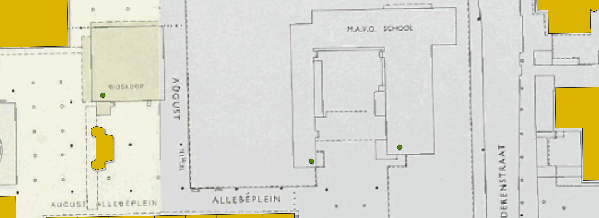

# De kaart van (rond) 1985 

De de adressen op de kaarten die Loman (1876) en Publieke werken (1909, 1943) maakte zijn allemaal ingeprikt en [digitaal beschikbaar](https://adamlink.nl/geo/addresses/start/) gemaakt. De kaart van de Dienst Openbare Werken uit 1985 is op [Amsterdam Timemachine](https://tiles.amsterdamtimemachine.nl/) met voornoemde kaarten als tiles beschikbaar, maar de adressen erop zijn nooit geprikt. Dat is jammer, want er is voor 1985 niet alleen flink wat gebouwd, maar inmiddels ook weer gesloopt. Juist die panden, en de mensen die er woonden of werkten, kunnen we niet meer 'plaatsen'.

Probleem is dat het georefereren van alle 1985 huisnummers gewoon erg veel werk is, Amsterdam was in de voorafgaande decennia flink gegroeid. De vraag is ook hoe zinnig zo'n klus is. De overgrote meerderheid van de adressen bestaat nog steeds en is in de BAG te vinden. Zou je kunnen volstaan met het inprikken van alleen die adressen die buiten die meerderheid vallen? Het gaat dan om:

1. Panden die na de oorlog zijn gebouwd en na 1985 zijn gesloopt - voordat de BAG bestond of historie op ging bouwen.
2. Panden die zowel op de kaart van 1943 als 1985 te zien zijn, maar niet in de BAG voorkomen.
3. Hernummeringen in de periode 1943-1985 of in de periode 1985-BAG.

## Werkwijze 1

Voor wat de na-oorlogse wijken betreft kon ik in QGIS de onder 1) genoemde panden vinden door polygonen van BAGpanden met een bouwjaar van voor 1986 over de kaart van 1985 te leggen.

_In geel de BAGpanden met een bouwjaar van voor 1986. De vier rijtjes die niet worden afgedekt zijn inmiddels gesloopt._

_Vervang je de kaart van 1985 door de huidige dan zie je dat op die plekken inmiddels nieuwe woningen staan._

Eenmaal gevonden is het eigenlijk alleen nog een kwestie van inprikken. Omdat de huisnummers op de tiles vaak slecht leesbaar zijn moest ik er wel de originele kaartbladen uit de beeldbank bijpakken. Die zijn gelukkig snel te vinden met de [Kaart-SPARQL tool](https://bertspaan.nl/kaart-sparql/) die Bert Spaan maakte, voortbouwend op ons [HackaLOD project](https://github.com/bertspaan/hackalod/) uit 2018.

_Nieuwe locatiepunten met 1985 adressen_

## Werkwijze 2

Om de onder 2) genoemde panden te vinden en in de 1985 dataset op te nemen heb ik de 1943 adressen erbij gepakt:

_In geel nog steeds de panden met bouwjaren van voor 1986, de bruine stippen zijn de 1943 adressen._

De 1943 adressen die in 1985 nog steeds op dezelfde plaats lagen kon ik kopiëren en in de 1985 dataset plakken. Was er inmiddels een ander huisnummer op dat punt, dan pas ik dat nummer aan. In beide gevallen neem ik de in de 1943 set vermeldde locatiepunten op, zodat we een relatie kunnen leggen tussen adressen in beide sets.

## Hoeveelheid werk

Het is nog steeds lastig inschatten hoeveel werk het is om de gaten in de hele stad zo in te tekenen, maar het kost natuurlijk maar een fractie van de tijd die nodig zou zijn om elk adres te prikken. Met de Baarsjes, de Kinkerbuurt, Da Costabuurt, Overtoomse Veld en Slotervaart Noord ben ik een uur of vier bezig geweest.

Als je weet dat Amsterdam ongeveer 100 wijken telt en ik er nu dus 5 gedaan heb, kan je de rekensom `4 uur * 20 = 80 uur` maken, maar dat blijft nattevingerwerk. De ene wijk is de andere niet.

_De Baarsjes, de Kinkerbuurt en de Da Costabuurt. De overgrote meerderheid betreft locatiepunten die ook in 1943 al bestonden._

_Wijken met 'nieuwe' locatiepunten. In Overtoomse Veld is veel gewijzigd, in Slotervaart Noord weinig._

De resultaten die je op de afbeeldingen ziet staan hier trouwens ook als [geojson bestand](1985-wgs.geojson).

## Bonus: gebouwnamen

Gebouwnamen als 'BIOSKOOP' en 'M.A.V.O. SCHOOL' heb ik ook overgenomen.

_Het August Allebéplein_

## Haken en ogen

- De kaart is natuurlijk niet precies van 1985, maar gemaakt in een periode die meerdere jaren bestrijkt. Er zal best een pandje doorheen glippen hier en daar.
- Hernummeringen van bestaande panden vind je op deze manier niet.

Kom je dergelijke gevallen tegen, dan ligt er straks wel een 1985 dataset waar je relatief eenvoudig adressen aan toe kunt voegen.