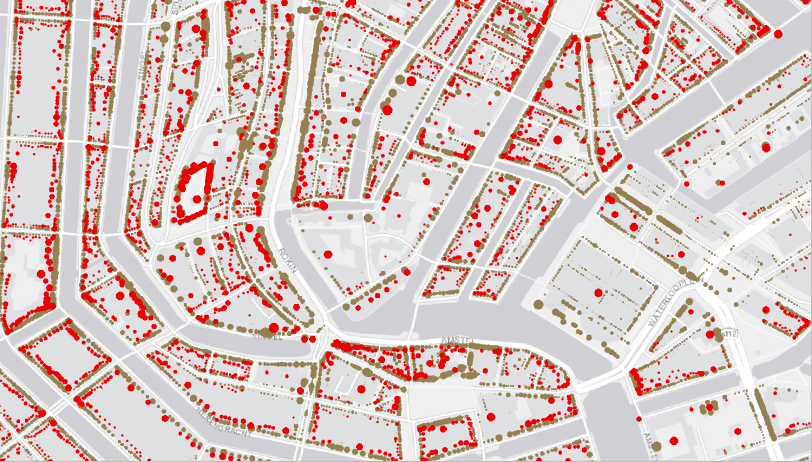

# Beeldbank geocoderen

De [beeldbank](https://archief.amsterdam/beeldbank/) van het Stadsarchief Amsterdam bevat meer dan 450.000 afbeeldingen. Daarvan zijn er 381.827 met één of meer geografische namen verbonden. Die geografische namen kunnen (in de dump die ik kreeg althans) drie velden bevatten: 

- `straat` - voor straatnamen, maar is ook gebruikt voor havens, parken, etc.
- `huisnummer_van` bevat het eerste huisnummer van een reeks
- `huisnummer_tot` bevat het laatste huisnummer van een reeks

Om van een geografische naam naar geografische entiteiten (een Adamlink adres of straat, een BAG pand of een Wikidata item) te komen moesten de volgende hordes genomen worden:

- Betreft de straatnaam inderdaad een straat? Wat is dan de Adamlink URI of het BAG openbare ruimte id?
- Betreft de straatnaam een andere geografische entiteit? Is daar een Wikidata item bij te vinden?
- Is in `huisnummer_van` en `huisnummer_tot` het begin en einde van een reeks vermeld? Hoe bepalen we dan de tussenliggende nummers in die reeks?
- Aan welk adres of pand zou elk huisnummer in die reeks gekoppeld moeten worden? De BAG is natuurlijk een optie, maar omdat adressen verdwijnen en panden hernummerd kunnen worden zijn [historische adressen](https://adamlink.nl/geo/addresses/start/) vaak geschikter. De datering van de afbeelding is hierbij natuurlijk van belang.

## Aanpak reeksen

Wat met de reeksen natuurlijk een grote rol speelt, is de vraag of er doorlopend genummerd is, of dat er alleen even of alleen oneven nummers op de afbeelding staan. 

Ik heb gekeken of de tussengelegen huisnummers op basis van geometrie te bepalen waren. Daartoe is een rechthoek getrokken om het het vanaf- en totnummer, en gekeken is welke huisnummers daarbinnen vielen.

Bij straten die noord-zuid of oost-west lopen heb ik de rechthoek met enkele meters verbreed om te voorkomen dat niet precies op lijn ingetekende adressen erbuiten vielen. Al met al ging dat vaak goed, al kwamen bij smalle straten met een meer diagonale oriëntatie ook huisnummers van de overzijde binnen de rechthoek. Daar zou je eventueel nog wat op kunnen bedenken (bijvoorbeeld even nummers schrappen als er veel meer oneven nummers zijn, of andersom; of kijken naar de afstand tussen opeenvolgende nummers).

Lastiger op te lossen, met die methode, zijn de huisnummers die niet netjes op een rijtje liggen, zoals de villa's langs de Amstel hieronder.

Uiteindelijk kon ik dankzij het werk van Hans Kleijn, die (vooral) op basis van geometrie bepaalde welke straten wel en welke niet doorlopend genummerd zijn, een eenvoudiger oplossing hanteren. [Deze blog](https://www.amsterdam.nl/stadsarchief/organisatie/blog-bronnen-bytes/juiste-adres-(5)-uitpluizen-adresreeksen/) legt zijn werkwijze uit.

Op basis van een uit zijn werk gedestilleerde [lijst van doorlopend genummerde straten](doorlopend.csv) heb ik uiteindelijk bepaald wat de tussenliggende huisnummers waren, en dat bleek goed te werken. Theoretisch kan het natuurlijk zo zijn dat een straat die tegenwoordig doorlopend genummerd is dat in het verleden niet was, maar ik ben zoiets niet tegengekomen.

Opvallend was verder nog dat in de vanaf- en totnummers geen huisnummers met toevoeging, zoals bijvoorbeeld '20 A' voorkwamen. In de tussenliggende reeks heb ik die gevallen wel meegenomen.

## Aanpak dateringen

Op basis van de datering van de afbeelding is het in tijd meest nabije adres gezocht in verschillende bronnen: is de foto bijvoorbeeld van 1918 dan is gezocht naar adressen van kaarten uit 1909 en 1943, en als het adres op beide voorkwam, dan is dat van 1909 gekozen.

Bij na-oorlogse afbeeldingen is daar iets van afgeweken. Vanwege de tachtig jaar tussen de kaart van 1943 en de huidige BAG (een periode waarin bovendien veel gesloopt en gebouwd is), zijn adressen / panden uit beide sets opgenomen. Bij BAGpanden is daarbij wel gekeken naar de bouwjaren - waren die van na de afbeelding, dan is het pand niet meegenomen.

_Amsteldijk, tweemaal de gekoppelde 1943 adressen en bagpanden - links met als achtergrond de 1943 kaart, rechts als achtergrond openstreetmap_

De foto van de villa's aan de Amstel die hierboven ook al langskwam is zodoende verbonden met zes 1943 adressen en met drie BAGpanden. De foto is van 1973, en de middelste vier panden zijn uit 1980 en 1981.

## Resultaten koppelingen met straten

Iets minder dan de helft van de afbeeldingen is niet met specifieke adressen, maar alleen met een straat of andere geografische entiteit verbonden. Het gaat om 253.428 gekoppelde locaties. Daarvan konden er 206.735 verbonden worden met 4.534 Adamlink straten.

Op het kaartje hieronder zijn de straten donkerder gekleurd naarmate er meer afbeeldingen van zijn. Niet heel verrassend scoren langere en doorgaande straten, vooral in het centrum, goed. 

## Resultaten koppelingen andere geografische entiteiten

Naast straten zijn er nog heel veel andere geografische entiteiten in de data te vinden: waterwegen, havens, volkstuinparken, buurten, plaatsen, etc. Al deze entiteiten zijn te verbinden met Wikidata. Niet alles staat al op Wikidata, maar je kan er altijd zelf dingen aan toevoegen. Binnen dit project heb ik dat vooral gedaan voor [volkstuinparken](https://w.wiki/6oDX) en [havens](https://w.wiki/6oam).

 

In Adamlink zijn alleen Amsterdamse straten opgenomen. Straten elders zijn met Wikidata verbonden; op het kaartje hierboven zijn Amstelveense straten goed te zien.

## Resultaten adreskoppelingen

Alle aantallen in de tabel hieronder betreffen aan afbeeldingen gekoppelde straat+huisnummerreeksen, dus bijvoorbeeld 'Staalstraat 2 t/m 10'. Maar ook het enkele pand 'Nes 2 t/m 2' is zo'n reeks. Aan afbeeldingen kunnen meer van die reeksen gekoppeld zijn.

Er zijn in totaal 272.924 van deze reeksen. In 429 gevallen kon een straatnaam niet aan een adamlink straaturi gekoppeld worden, een noodzakelijke stap om naar een adres te komen. Dit kunnen straten zijn die nog onbekend zijn in Adamlink, maar meestal zijn het straten die niet in Amsterdam liggen of namen die ambigu zijn of waarin iets mis is gegaan met character encoding.

| datering 1) |totaal  |1876   |1876-1909 2)| 1909-1943 2)| 1943    |  bag 3) | geen   |
|-------------|--------|------:|------------|----------|---------|---------|-------:|
| 1945 >      |173.711 |       |            |          | 132.198 |130.741  |17.884  |
| 1909-1945   |39.369  |       |            |35.482    |         |         |3.887   |
| 1876-1909   |29.054  |       |25.997      |          |         |         |3.057   |
| < 1876      |15.204  |12.547 |            |          |         |         |2.657   |
| zonder      |15.157  |		 |            |          |         |         |15.157  |

_1) als datering van de afbeelding is het eerste jaartal in het veld datering gebruikt_  
_2) gekozen is steeds voor het adres dat het dichtst bij de datering van de afbeelding lag_  
_3) een koppeling met een BAG pand is alleen opgenomen als de datering van de afbeelding na het bouwjaar valt_

_Dit kaartje toont (centroiden van) bagpanden (rood) en historische adressen daaronder (bruin), groter weergegeven naarmate vaker afgebeeld. De Waterloopleinbuurt, de Weesperstraat en de oostzijde van het Rokin laten het belang van de historische adressen zien._

Mocht je je afvragen waarom aan BAGpanden is gekoppeld en niet aan BAGadressen: 

- De historische 'adressen' zijn vaak meer pand dan een adres zoals de BAG dat definieert. Ze zijn overgenomen van 2D kaarten waarop geen verschillende adressen voor verschillende verdiepingen zijn opgenomen, zoals dat in de BAG wel het geval is.
- Ook in de beeldbank metadata zijn alleen reeksen als 'Haarlemmerstraat 6 t/m 8' opgenomen. Zo'n afbeelding verbinden met alle BAGadressen voor de verschillende verdiepingen in die panden zou valse precisie geven - misschien is alleen een winkelpui op de afbeelding weergegeven.
- De aard van de beeldbank is dat het vaak aanzichten van panden betreft; bij andere bronnen zou je een andere keuze kunnen maken.
- Er kunnen ook gewoon heel veel adressen in een pand zijn; elke foto van een flat of bijvoorbeeld het CS zou dan tientallen of zelfs honderden links opleveren.

_Het station is in de BAG één pand met 114 bijbehorende adressen_

## De aantallen

Hieronder het aantal keer dat een afbeelding met een specifieke geografische entiteit is verbonden:

- **43.833** koppelingen met Wikidata
- **346.593** koppelingen met BAGpanden
- **754.574** koppelingen met historische adressen
- **272.968** koppelingen van niet aan adamlink adres verbonden afbeeldingen met adamlink straten
- **206.224** koppelingen van ook aan adamlink adres verbonden afbeeldingen met adamlink straten

## Hoe nu verder?

In het tabelletje hierboven is te zien dat steeds zo'n tien procent van de gedateerde afbeeldingen niet aan een historisch adres of BAGpand gekoppeld kon worden. Alleen bij de oudere afbeeldingen, van voor 1876, loopt dat iets verder op. Naar de oorzaken heb ik geen diepgravend onderzoek gedaan, maar ik ben wel een paar dingen tegengekomen:

- Niet elke afbeelding is even goed gedateerd. Zo is [een afbeelding van het in 1897 gesloopte Koninklijk Postkantoor](https://archief.amsterdam/beeldbank/detail/70012090-8527-11e4-b8cb-c3e8d678fdba) gedateerd als 1953-1995 (omdat van de oorspronkelijke foto in die periode een reproductie is gemaakt, vermoedelijk).
- Een batch van 15.000 afbeeldingen zonder datering is helemaal buiten beschouwing gelaten, om vals positieven te vermijden.
- Zo'n 450 afbeeldingen zijn nog niet met een adamlink straat verbonden ('Gein' bestaat niet als straat, 'Curaçaostraat' had een probleem met encoding, 'Notweg' is ambigu), een vereiste om tot een adres te komen.
- De referentiedata laat het soms ook afweten. Vooral tussen 1945 en het begin van de BAG zit een gat van zeventig jaar, waarin panden soms zowel gebouwd als verdwenenen zijn; dit gat valt bovendien samen met de periode waarin veel gefotografeerd werd.

Veel van deze afbeeldingen (vooal de verkeerd- of ongedateerde) zouden alsnog gekoppeld kunnen worden - handmatig, in crowdsourceprojecten of zelfs geautomatiseerd (maar dan wel misschien met een controle achteraf).

Ook de referentiedata kan beter. Veel in 'het gat' gevallen adressen zijn terug te vinden op de Publieke Werken kaartbladen uit de jaren '70 en '80. Samengevoegd en beschikbaar gemaakt als tiles zijn deze kaarten bekend als [1985 - Dienst Openbare Werken](https://tiles.amsterdamtimemachine.nl/). Binnen dit project heb ik gekeken met welke werkwijze die 1985 adressen alsnog gegeorefereerd en beschikbaar gemaakt kunnen worden via [adamlink](https://adamlink.nl/geo/addresses/start/). De uitkomsten en de eerste resultaten daarvan zijn [elders in deze repository](1985/readme.md) te vinden.